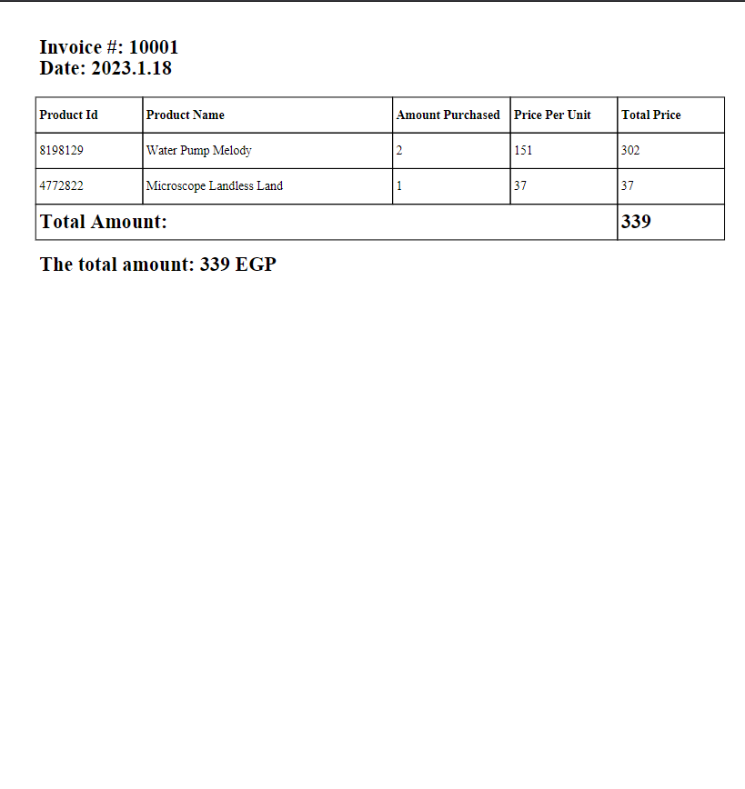

### Project Name: InvoicePDFGenerator

## Description:
InvoicePDFGenerator is a Python script designed to automate the generation of PDF invoices from Excel files. The script reads data from Excel files located in the "Invoices" directory, formats the information, and creates corresponding PDF files in the "PDFs" directory. Each PDF includes details such as the invoice number, date, itemized list, and total amount.

## Features:
- Dynamically generates PDF invoices from Excel files.
- Extracts and formats relevant information, including invoice number, date, and itemized list.
- Calculates and displays the total amount on each PDF.
- Organizes generated PDFs in the "PDFs" directory.

## How to Use:
1. Place your Excel invoices in the "Invoices" directory.
2. Run the script to automatically generate PDFs in the "PDFs" directory.
3. Retrieve the neatly formatted PDF invoices for your records.

## Requirements:
- Python 3.x
- pandas library (`pip install pandas`)
- fpdf library (`pip install fpdf`)

## Usage Example:
```python
python invoice_pdf_generator.py
```

## Note:

<font color="red">**Ensure that your Excel files follow a specific naming convention for proper extraction of invoice number and date.**

Example of file names:
"10001-2023.1.18.xlsx" => 10001 is the invoice number, and 2023.1.18 is the data.
</font>

## Example:
### Input Sample


### Output Sample


Feel free to explore and enhance this tool to suit your specific invoicing needs!
