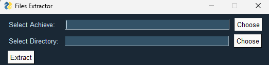

# File Extractor
The File Extractor is a groovy GUI app that allows you to extract files from archives with ease. Simply select an archive and a directory, and watch the magic happen! 📂✨

### How to Use
1. Make sure you have Python installed on your system.
2. Clone this repository to your local machine.
3. Install the required dependencies by running the following command:   pip install PySimpleGUI
4. Execute the main.py script to launch the File Extractor.
5. The File Extractor GUI window will appear.
6. Click the "Choose" button next to "Select Archive" to browse and select the archive file you want to extract.
7. Click the "Choose" button next to "Select Directory" to browse and select the destination directory where you want to extract the files.
8. Finally, click the "Extract" button to start the extraction process.
9. Sit back, relax, and let the File Extractor do its magic! Once the extraction is complete, you'll see a message indicating the success.

Feel free to explore the code in Extractor.py to see how the extraction process is implemented. If you encounter any issues or have suggestions for improvement, don't hesitate to reach out. Happy extracting! 🚀

### Contact Me. 
If you encounter any issues or have suggestions for improvement, feel free to reach out. Happy Extracting! 🎒✨