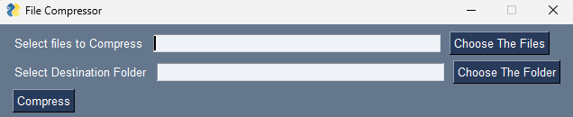

# File Zipper
The File Zipper is an awesome GUI app that lets you compress multiple files into a single zip archive with style. It's like creating a file sandwich! 🥪💥

### How to Use
1. Ensure you have Python installed on your machine.
2. Clone this repository to your local system.
3. Install the necessary dependencies by running the following command:   pip install PySimpleGUI  
4. Run the main.py script to launch the File Zipper.
5. The File Zipper GUI window will pop up.
6. In the "Select files to Compress" field, enter the paths of the files you want to compress, separated by semicolons (;).
7. Click the "Choose The Files" button to browse and select the files you want to compress.
8. In the "Select Destination Folder" field, enter the destination folder where you want to save the compressed file.
9. Click the "Choose The Folder" button to browse and select the destination folder.
10. Finally, click the "Compress" button to start the compression process.
11. Sit back and watch as the File Zipper creates a groovy zip file containing all the selected files.Feel free to dive into the code in filezipping.py to see how the compression process is implemented.
### Contact Me. 
If you encounter any issues or have suggestions for improvement, feel free to reach out. Happy zipping! 🎒✨
